= TS2 Technical Manual
Author Nicolas Piganeau
:prewrap!:
:toc:
:sectnums:

== Introduction

This document describes the internals of TS2.
It is aimed both at simulation writers and developers who want to interact with the simulation through its API.

== Architecture

TS2 is composed of 3 main components:

- The simulation server
- Clients
- The editor

=== The simulation server

This is the central piece of the software. It is shipped with the TS2 release.

It can be run:

- Locally for a standalone game
- Remotely on another PC or even on a cloud server for multi-player gaming

The TS2 sim server tasks are

- To centralize the game data, that is:
    * Scenery layout (The track items, and how they are connected to each other, their states, etc.)
    * Possible and set routes
    * Services and Trains

- To enforce interlocking on :
    * Route setting/unsetting
    * Change of points position
    * Update of signals aspects

- To compute train behaviour, speed and position

- Make the clock tick

The TS2 sim server communicates with clients through websocket.

.TS2 overall architecture
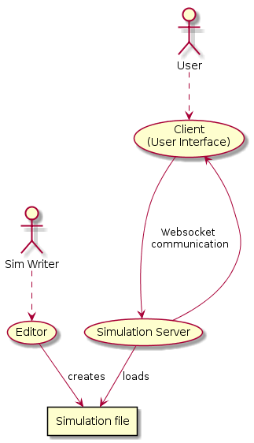

=== Clients

Clients are software that interact with the simulation server, typically to provide a user interface.

Many clients can be connected at the same time to the same simulation server.

The TS2 release ships two clients:

- The standard Python client, which is the main "all-in-one" client that is also able to spawn simulation servers and give access to the editor.
- A minimalist web client which is included with the simulation server and mainly used for API testing.
This client can be accessed at http://localhost:22222 when the sim server is running.

=== The Editor

The editor is part of the standard Python client and is used to create or modify simulations with a graphical user interface.

== Simulation model

A simulation in TS2 is modelled by the following objects:

- Options
- Track items
- Routes
- Train Types
- Services
- Trains
- Signal Library
- Message Logger

=== Options

This is a list of options for the simulation.
They must be set at simulation writing time, but can be modified during the simulation.

The default values in the table below are set by the editor.
The simulation server itself has no default and expect all options to be set.

[cols="2,>3,8"]
|===
| Key ^| Default Value | Description

|`title`
|
|Title of the simulation

|`description`
|
|Detailed description of the simulation targeted at the user.

|`clientToken`
|client-secret
|Client token to connect to the simulation.
Unless you want to run a public instance of TS2 you can leave it to the default value.

|`version`
|0.7
|Defines the version of the file format. Do not change this value.

|`timeFactor`
|5
|The number of seconds elapsed in the simulation for each real seconds.
This value can be set between 1 and 10.

|`currentTime`
|06:00:00
|Current time inside the simulation.
When writing a simulation this will be the time when the simulation starts.
During the simulation run, this value is updated every 500ms.

|`warningSpeed`
|8.33
|Speed (in metres per second) a train driver will observe when given a "Proceed with caution" manual order from the dispatcher.
Default value is 30 km/h.

|`currentScore`
|0
|This value is the current penalty score of the simulation.
Obviously, it should be set to 0 when writing a simulation.

|`defaultMaxSpeed`
|44.44
|This speed (in metres per second) will be used by the simulation whenever a track item has a maximum speed of 0.
Default value is 160 km/h.

|`defaultMinimumStopTime`
|[(45, 75, 70), (75, 90, 30)]
|The time in seconds a train will normally stop at a station.
It can be a single value in seconds, or a <<DelayGenerators,delay generator>>.

|`defaultDelayAtEntry`
|[(-60, 0, 50), (0, 60, 50)]
|The delay in seconds a train will have by default when entering the area.
It can be a single value in seconds, or a <<DelayGenerators,delay generator>>.
If the value is negative, the train will be early.

This value can be overridden train by train.

|`trackCircuitBased`
|false
|This value defines the way the trains will be represented on the layout.
If it is true, each track item will be considered as a track circuit and will be either marked free or occupied.
If it is false, the occupied area will show the real position of the train.

This option should be set to true if you care about realism.

|`defaultSignalVisibility`
|100
|Distance in metres at which a driver can see a signal and will start taking it into account.

|`wrongPlatformPenalty`
|5
|Penalty points that will be added to the score each time a train stops at a wrong platform.

|`wrongDestinationPenalty`
|100
|Penalty points that will be added to the score each time a train is not routed out of the area at the correct exit point.

|`latePenalty`
|1
|Penalty points that will be added to the score per minute lost in the area.
Delay at entry is subtracted from the actual delay to define it.

|===


====
[[DelayGenerators]]
.**Delay generators**

Delay generators are expressions that will yield a random value according to a specified distribution.

They are composed of a list of triplets such as:
```python
[(45, 75, 70), (75, 90, 30)]
```
For each triplet, the values are in order:

- Minimum value
- Maximum value
- Percentage of occurrence

In the example above, the expression means:

- 70% of the time the value will be between 45 and 75
- 30% of the time the value will be between 75 and 90

Inside each triplet, the value is yielded with a uniform distribution.

====

=== Track Items

The layout of the tracks in the area is defined by 8 track item types:

- Line
- Signal
- Points
- Platform
- Place
- End
- InvisibleLink
- Text

Each type has "definition attributes" which can be set with the editor and "technical attributes" which are returned by the simulator through the API.

==== Common Attributes

All items share the following attributes.

===== Definition Attributes

[cols="2,3,8"]
|===
|Technical Name |Attribute Name in Editor |Description

|`id`
|ID
|Unique ID of the item. The editor sets it automatically and it cannot be modified by the user.


|`\\__type__`
|Type
|Type of the item. The type of an item cannot be changed.

|`name`
|Name (or Text)
|Name of the item as known in the real world (e.g. signal number).

|`x`
|Position (or Point1)
|Position of the item on the x-axis.

|`y`
|Position (or Point1)
a|Position of the item on the y-axis.

WARNING: y-axis increases from top to bottom.

|`maxSpeed`
|Maximum speed (m/s)
|Maximum speed allowed on this item in metres per second.

|`realLength`
|Real Length (m)
|Length of this item in real life (in metres).

|`conflictTiId`
|Conflict item ID
|Set to the ID of another item to prevent route setting on both items at the same time.
This feature is typically used to interlock track crossovers without points.

|===

===== Technical Attributes

[cols="2,8"]
|===
|Technical Name  |Description

|`previousTiId`
|ID of the track item connected to this item at its "origin" (see each item description).

This is computed automatically by the editor.

|`nextTiId`
|ID of the track item connected to this item at its "end" (see each item description)

This is computed automatically by the editor.

|`activeRoute`
|If a route is set on this item, this value is the ID of that route, otherwise it is null.

|`activeRoutePreviousItem`
|If a route is set on this item, this value is the ID of the item before this one in the direction of the route, otherwise it is null.

|`trainEndsFW`
a|Map of train extremities that are on the "end" side of this item (see each item description).

For example, `{"2": 79}` means that train with ID "2" has one of its extremity (head or tail) at 79 metres from this items "origin".

|`trainEndsBK`
a|Map of train extremities that are on the "origin" side of this item (see each item description).

For example, `{"2": 3}` means that train with ID "2" has one of its extremity (head or tail) at 3 metres from this items "origin".

|===

.trainEndsFW and trainEndsBK
====
[[TrainEndsMaps]]
Consider the following figure with 2 trains, going from left to right.
`Train 1` spans over 3 track items, while `Train 2` is over a single track item.

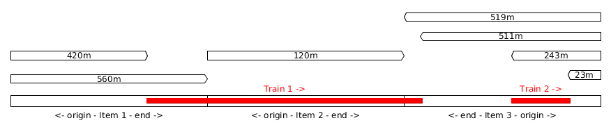

In this situation, the `trainEndsBK` and `trainEndsFW` maps are as follow:

[cols="1,3"]
|===
|Item 1
| `trainsEndsBK = {"1": 420}`

`trainsEndsFW = {"1": 560}`

|Item 2
|`trainsEndsBK = {"1": 0}`

`trainsEndsFW = {"1": 120}`

|Item 3
|`trainsEndsBK = {"1": 511, "2": 23}`

`trainsEndsFW = {"1": 519, "2": 243}`
|===

NOTE: When the `trackCircuitBased` option is true, the `trainEndsBK` and `trainEndsFW` are always with a value of 0 or
 of the length of the item so that the latter is either completely covered by a train or not at all.
====

==== Line Items

A line item connects two points on the scenery.
One is defined as the "origin" and the other one as the "end" (arbitrarily).

image::lineitem.png[align=center]

Common attributes `x` and `y` define the position of the "origin", known as "Point 1" in the editor.

[cols="2,3,8"]
|===
|Technical Name |Attribute Name in Editor |Description

|`xf`
|Point 2
|Position of "end" on the x-axis.

|`yf`
|Point 2
a|Position of "end" on the y-axis.

WARNING: y-axis increases from top to bottom.

|`placeCode`
|Place code
|Code of the place item this line item belongs to.
The place being a station or a waypoint.

|`trackCode`
|Track code
|The code of this track as known in the place defined by `placeCode`.
Typically a line or platform number.

|===

==== Signal Items

Signal items are composed of two elements, the signal itself and the "berth" that will hold train descriptors on the layout.

image::signalitem.png[align=center]

===== Standard Attributes

Common attributes `x` and `y` define the position of entry in the signal which is the left point of the signal itself.
Note that when the signal is reversed, then it is the point of the signal on the right.

[cols="2,3,8"]
|===
|Technical Name |Attribute Name in Editor |Description

|`signalType`
|Signal Type
|The code of the type of signal as defined in the signal library (e.g. `UK_3_ASPECTS`)

|`reversed`
|Reverse
|If true, then the signal is for train coming from the right of the layout.

|`xn`
|Berth Origin
|Position of the berth on the x-axis.
The position is the bottom left corner of the berth.

|`yn`
|Berth Origin
a|Position of the berth on the y-axis.
The position is the bottom left corner of the berth.

WARNING: y-axis increases from top to bottom.

|===

===== Technical attributes

[cols="2,8"]
|===
|Technical Name  |Description

|`activeAspect`
|Aspect name that this signal shows currently

|`trainID`
|ID of the train that has its descriptor on this signal's berth. 0 if the berth is empty.

|`previousActiveRoute`
|ID of the route that is set up to this signal. Empty string if none.

|`nextActiveRoute`
|ID of the route that is set starting from this signal. Empty string if none.

|===

===== Custom properties

Custom properties are defined by the available signal conditions.
Each property takes as value a map with signal aspect codes as keys and a list of related object IDs as values, such as:
```
{"UK_CLEAR": ["2", "34", "48"], "UK_CAUTION": ["2", "34"]}
```

Properties taken into account depend on the signal type.
The editor automatically prefills the properties depending on the signal type.
The table below lists the properties that are defined by conditions in the current version.

NOTE: See also <<Signal Aspect Resolution>>

[cols="2,2,2,5"]
|===
|Condition |Property Name in Editor |Related Objects |Description

|`TRAIN_NOT_PRESENT_ON_ITEMS`
|No Trains params
|Track Items
|List of items IDs on which there must not be a train for the aspect to show.
If there is a train on a single item of the list, the aspect does not show.

|`TRAIN_PRESENT_ON_ITEMS`
|Train Present Params
|Track Items
|List of items IDs on which there must be a train for the aspect to show.
If a train is missing on a single item of the list, the aspect does not show.

|`ROUTES_SET`
|Route set params
|Routes
|List of route IDs which can be activated for the aspect to show.
The aspect shows as soon as at least one of the specified route is active.

|===

==== Points Items

Points items are track switches.
They have three extremity: the common, normal and reverse ends as shown below.

image::pointsitem.png[align=center]

===== Definition Attributes

Common attributes `x` and `y` define the position of the center of points item.
Each extremity is at -5 or +5 along x and y axis.

[cols="2,3,8"]
|===
|Technical Name |Attribute Name in Editor |Description

|`xf`
|Common End
|Position of the common extremity along the x-axis.
Must be equal to -5, 0 or +5.

|`yf`
|Common End
a|Position of the common extremity along the y-axis.
Must be equal to -5, 0 or +5.

WARNING: y-axis increases from top to bottom.

|`xn`
|Normal End
|Position of the normal extremity along the x-axis.
Must be equal to -5, 0 or +5.

|`yn`
|Normal End
a|Position of the normal extremity along the y-axis.
Must be equal to -5, 0 or +5.

WARNING: y-axis increases from top to bottom.

|`xr`
|Reverse End
|Position of the reverse extremity along the x-axis.
Must be equal to -5, 0 or +5.

|`yr`
|Reverse End
a|Position of the reverse extremity along the y-axis.
Must be equal to -5, 0 or +5.

WARNING: y-axis increases from top to bottom.

|===

[NOTE]
====
In the editor, these attributes are defined by setting the cardinal point of the extremity such as:

- N => (0, -5)
- SW => (-5, +5)
====

===== Technical Attributes

[cols="2,8"]
|===
|Technical Name  |Description

|`reverseTiId`
|ID of the track item connected to this item at its "reverse" end.

This is computed automatically by the editor.

|`reverse`
|true if the points are set to the reverse end, and false if they are set to the normal end.

|===

==== Platform Items

Platform items are mostly decorative.
They can be linked to a place and a track code.

image::platformitem.png[align=center]

Common attributes `x` and `y` define the position of "Point 1".

[cols="2,3,8"]
|===
|Technical Name |Attribute Name in Editor |Description

|`xf`
|Point 2
|Position of Point 2 along the x-axis.

|`yf`
|Point 2
a|Position of Point 1 along the y-axis.

WARNING: y-axis increases from top to bottom.

|`placeCode`
|Place code
|Code of the place item this platform item belongs to.
The place being a station or a waypoint.

|`trackCode`
|Track code
|The code of this platform as known in the place defined by `placeCode`.
Typically a platform number.

|===

==== End Items

End items are technical items used to connect free extremities of the simulation.

image::enditem.png[align=center]

All extremities, including those after a buffer **MUST** be filled with an end item, so that all items are linked to other items.

==== Place Items

Places represent  stations or waypoints. They are represented by a text label on the scenery.

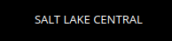

The common attribute `name` is the name of the place as displayed.

[cols="2,3,8"]
|===
|Technical Name |Attribute Name in Editor |Description

|`placeCode`
|Place code
|Code that will be used to reference this place in other items.

|===

==== InvisibleLink Items

Invisible links work exactly the same way as line items, but are not represented at all on the scenery.

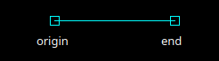

==== Text Items

Text items are purely decorative.
Use them to add labels which are not station or waypoint names, such as track or platform no.

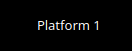


The caption is set through the `name` attribute.

=== Routes

A route is a locked path from one signal to another signal.
It will lock all the points in the correct position and open the entry signal.
The route is locked until either a train passes over, or the signaller cancels the route manually.

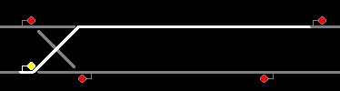

A route can be set as "persistent".
In this case, it cannot be released by a train and must be cancelled manually.

==== Definition Attributes

[cols="2,3,8"]
|===
|Technical Name |Attribute Name in Editor |Description

|`id`
|Route no.
|Route ID used to reference this Route.
It is set automatically by the editor and cannot be changed.

|`beginSignal`
|Begin Signal
|ID of the entry signal item on the scenery.

|`endSignal`
|End Signal
|ID of the exit signal item on the scenery.

|`initialState`
|Initial state
|State of the route at the beginning of the simulation.
Takes a <<RouteStates,Route State>> Value

|===

====
[[RouteStates]]
**Route States Values**

[cols="1,2"]
|===
|Value| Description

|0
|Route is not set

|1
|Route is set, with automatic release when a train passes over

|2
|Route is set and persistent

|3
|Route is being released.
This is a route that was in state 1, but that is currently being released
(i.e. the beginning of the route behind the train is not activated anymore but the end of the route in front of the train is still active.)

|===
====

==== Technical Attributes

[cols="2,3,8"]
|===
|Technical Name |Attribute Name in Editor |Description

|`state`
|Current state
|Current state of the route.
Takes a <<RouteStates,Route State>> Value

|`directions`
|Points directions
|Map of the points directions along this route.
Each key is a points item ID and the value a <<PointsPositions,Points Position>> value such as `{"512":1,"521":1}`

If a points does not appear in the map, either its position is obvious (i.e. route goes from the normal or reverse end to the common end)
or it is assumed that it is in the "normal" position.
|===

====
[[PointsPositions]]
**Points Positions Values**

[cols="1,2"]
|===
|Value| Description

|0
|Normal position

|1
|Reversed position (i.e. diverging)

|2
|Unknown position, usually because the points are moving

(not implemented yet, reserved for future releases)

|3
|Points have a failure

(not implemented yet, reserved for future releases)

|===
====

=== Train Types

Train types are the different kinds of rolling stock available in the simulation.

[cols="2,3,8"]
|===
|Technical Name |Attribute Name in Editor |Description

|`id`
|Code
|Code used to reference this train type

|`description`
|Description
|Human readable description of this train type (e.g. "Class 313/2 EMU")

|`length`
|Length (m)
|Length in metres of this rolling stock

|`maxSpeed`
|Max speed (m/s)
|Maximum speed in metres per second

|`stdAccel`
|Std acceleration (m/s2)
|Standard acceleration in metres per square second.
A train will always speed up on a constant ramp (over time) defined by this value.

|`stdBraking`
|Std braking (m/s2)
|Standard braking in metres per square second.
A train will slow down on a constant ramp (over time) defined by this value when it can foresee a speed limit ahead with sufficient prior notice.

|`emergBraking`
|Emerg. braking (m/s2)
|Maximum braking capacity in metres per square second.
When a speed limit arises without sufficient prior notice, the train will brake as much as it can with a constant ramp (over time), not exceeding this value.

|`elements`
|Elements (codes list)
|List of other train type codes this rolling stock is composed of, such as `["C313-2", "C313-2"]`

This information will be used in future version for splitting/joining trains.
|===

=== Services

Services are train schedules.
A service is composed of several lines, defined by a place and a time.

==== Service Attributes

[cols="2,3,8"]
|===
|Technical Name |Attribute Name in Editor |Description

|`id`
|Code
|Code used to reference this service.
It the code that will be used as the train descriptor on the layout.

|`description`
|Description
|Free human readable description of the service.

|`plannedTrainType`
|Planned Train Type
|The train type code that is expected for this service.

|`postActions`
|Next service code / Auto reverse
|Actions to be performed automatically by a train when it terminates this service.
It must be a list of <<TrainActions,train actions>>.

e.g. `"postActions":[{"actionCode":"SET_SERVICE","actionParam":"WB02"},{"actionCode":"REVERSE","actionParam":""}]`

|`lines`
|
|Lines of this service. It is a list of <<Service Line Attributes, service lines>> as defined below.

|===

====
[[TrainActions]]
**Train Actions**

A train action is a map with two keys:

[cols="1,2"]
|===
|`actionCode`|The code of the action to perform (see below).
|`actionParam`|The parameters for the action (if applicable for the given action).
|===

Currently two actions are implemented

[cols="1,1,2"]
|===
|Action Code|Action Parameters|Description

|`SET_SERVICE`
|service code
|Assign the service with the given service code to this train.

In the editor, this action is set by filling in the "Next service code".

|`REVERSE`
|None
|Reverse the train direction.

In the editor, this action is set by the "Auto reverse" field.

|===

====

==== Service Line Attributes

[cols="2,3,8"]
|===
|Technical Name |Attribute Name in Editor |Description

|`placeCode`
|Place code
|Code of the place (station or waypoint)

|`scheduledArrivalTime`
|Arrival Time
|Time at which the train is expected to arrive at the place of this line.

Should be left empty (i.e. "00:00:00") when the train does not stop at this place.

|`scheduledDepartureTime`
|Departure Time
|Time at which the train is expected to depart (or pass) at the place of this line.

|`mustStop`
|Stop
|Set to `true` if the train must stop at this station.

|`trackCode`
|Track code
|Track or platform no. at which this train is expected to stop (or pass) at this place.

|===

=== Trains

Trains are the rolling stock instances that run in the Simulation.
Most of the time a service is assigned to a train.

==== Definition Attributes

[cols="2,3,8"]
|===
|Technical Name |Attribute Name in Editor |Description

|`id`
|id
a|Internal ID of the train, automatically assigned.

NOTE: This ID is an integer and can be different in the editor and in the simulation.

|`serviceCode`
|Service code
|ID of the service assigned to this train

|`trainTypeCode`
|Train type
|ID of the rolling stock type of this train

|`appearTime`
|Entry time
|Time at which this train appears on the layout

|`trainHead`
|Entry position
|Position of the train head. This is a <<Positions,position>> object.

|`initialSpeed`
|Entry speed
|Speed of this train when it appears on the scenery

|`initialDelay`
|Initial delay
|Delay from `appearTime` that this train will have when entering the area.
This field is either an integer (in seconds) or a <<DelayGenerators,delay generator>>.

Set this field to 0 tu user the `defaultDelayAtEntry` value from the <<Options,options>>

|===

====
[[Positions]]
**Positions**

A position object uniquely defines a position and a direction on the scenery.

[cols="1,3"]
|===
|Attribute Name |Description

|`trackItem`
|ID of the item this position is on.

|`previousTI`
|ID of one of the connected item defined as "Previous Item" to give the direction.

|`positionOnTI`
|Number of metres between this position and the extremity of `trackItem` that is connected to `previousTI`.

|===


On the image below, positions `P1` and `P2` are defined as follow:

`P1 = {"trackItem":"2","previousTI":"1","positionOnTI":73}`

`p2 = {"trackItem":"2","previousTI":"3","positionOnTI":98}`

.Positions
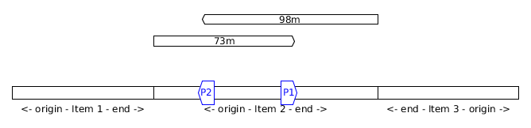

====

==== Technical Attributes

[cols="2,8"]
|===
|Technical Name |Description

|`status`
|Current status of the train. See available <<TrainStatus,train status values>>.

|`speed`
|Current speed of the train in metres per second

|`nextPlaceIndex`
|Index of the next service line, i.e. the index to the next station or waypoint. Counted from 0.

|`stoppedTime`
|The number of seconds the train has stopped at the station.
If the train status is not "Stopped", this value has no meaning.

|===

====
[[TrainStatus]]
**Train Status Values**

[cols="1,1,3"]
|===
|Code |Status | Description

|0  |Inactive    |The train has not entered the area yet
|10 |Running     |The train is running with a non zero speed
|20 |Stopped     |The train is stopped at a station
|30 |Waiting     |The train is waiting at a red signal or other unscheduled stop
|40 |Out         |The train exited the area
|50 |EndOfService|The train has finished its service and has not been assigned a new one
|===
====

==== Standard Train Behaviour

Train behaviours are defined in compile-time plugins called train managers.
TS2 ships by default with a "Standard Manager" which makes the trains behave as described in this section.

The train driver will always try to reach the maximum possible speed limited by :

- The train type's maximum speed
- The speed limit of the line, both the current limit and reduced speed limits ahead
- The distance to the next station the train should stop
- The speed limit imposed by signals

For speed limits ahead (such as reduced line speed or next station or signal aspect),
 the maximum speed allowed is defined by a constant speed ramp (over time) of `stdBraking` (or `stdAccel`)
 in order to be at the target speed at the target point.

=== Signal Library

The Signal Library holds the information about each signal available in the simulation.
It is composed of a list of "Signal Aspects" and "Signal Types".

[cols="2,8"]
|===
|Technical Name |Description

|`signalAspects`
a|Map of signal aspects. The key is the name of the aspect, the value is a <<Signal Aspects,signal aspect object>>.

A signal aspect is the colour of a signal lamp or combination of lamps on one signal.
The signal aspect provides an unambiguous message to the driver of a train.
In TS2, this message is a list of actions to perform.

|`signalTypes`
a|Map of signal types. The key is the name of the type, the value is a <<Signal Types,signal type object>>.

A signal type defines a kind of signal capable of displaying a set of aspects depending on conditions.

NOTE: The signal type usually differs between the simulation and reality, as a signal type in the simulation can be configured to simulate several real types.

|===

==== Signal Aspects

===== General Attributes
[cols="2,8"]
|===
|Technical Name |Description

|`name`
a|Code of the signal aspect. This code must be unique and is used to reference this aspect in the simulation.

|`lineStyle`
a|Defines how the line along the signal must be displayed.
Possible values are:

[cols="1,1,3"]
,===
Code,Style,Description

`0`,`lineStyle`,Normal signal placed on the side of the line
`1`,`bufferStyle`,Buffer
,===

|`actions`
a|List of actions to be done by the train driver when seeing this signal. See <<SignalActions,signal actions>>

Examples
[cols="1,3"]
:===
`[[2, 0]]`: Prepare to stop before the next signal.
`[[1, 0, 60], [0, 8.33]]`: Stop before this signal, wait 60 seconds and proceed at 8.33 m/s (30 km/h).
:===
|===

====
[[SignalActions]]
**Signal Actions**

A signal action is a triplet with, in order:

- A <<Targets,target>>
- A speed limit (in m/s) to respect at target
- A delay in seconds before executing the next action (optional if there is no next action)


[[Targets]]
.Signal Action Targets
[cols="1,1,3"]
|===
|Code |Target |Description

|0 |ASAP |The target speed should be applied as soon as possible
|1 |BeforeThisSignal |The target speed should be applied before the train reaches this signal
|2 |BeforeNextSignal |The target speed should be applied before the train reaches the signal after this one.

|===
====

===== Display Attributes

Signal aspects in TS2 can show up to 6 lamps at the same time (numbered 0 to 5) that are arranged like this:

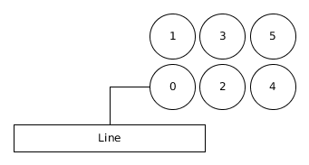

Attributes in the table below are lists.
Each item refer to a lamp based on its index (counted from 0).
Clients are expected to render signals as explained below.

[cols="2,8"]
|===
|Technical Name |Description

|`outerShapes`
|List of outer shapes.
Outer shapes should be drawn first.
Each item of the list must be <<ShapeCode,shape code>>.

|`outerColors`
|List of colors to fill the outer shapes.
Each item of the list must be a `#RRGGBB` color string.

|`shapes`
|List of shapes.
Shapes should be drawn in front of outerShapes without transparency.
Each item of the list must be <<ShapeCode,shape code>>.

|`shapesColors`
|List of colors to fill the shapes.
Each item of the list must be a #RRGGBB color string.

|`blink`
|List of boolean values.
If the value is true, the corresponding lamp should be displayed as flashing.

|===

====
[[ShapeCode]]
**Shape Codes**

[cols="1,1,3"]
|===
|Code |Shape |Image

|0  |`none`   |Nothing should be drawn at the position of the corresponding lamp.
|1  |`circle` a|image::circleShape.png[]
|2  |`square` a|image::squareShape.png[]
|10  |`quarterSW` a|image::quarterSWShape.png[]
|11  |`quarterNW` a|image::quarterNWShape.png[]
|12  |`quarterNE` a|image::quarterNEShape.png[]
|13  |`quarterSE` a|image::quarterSEShape.png[]
|20  |`barNS` a|image::barNSShape.png[]
|21  |`barEW` a|image::barEWShape.png[]
|22  |`barSWNE` a|image::barSWNEShape.png[]
|23  |`barNWSE` a|image::barNWSEShape.png[]
|31  |`poleNS` a|image::poleNSShape.png[]
|32  |`poleNSW` a|image::poleNSWShape.png[]
|33  |`poleSW` a|image::poleSWShape.png[]
|34  |`poleNE` a|image::poleNEShape.png[]
|35  |`poleNSE` a|image::poleNSEShape.png[]

|===

NOTE: Cardinal points in the Shape and images code should be understood **with the signal head up**
(i.e. N to the right of the screen, or to the left is signal is reversed).
====

.Signal aspects rendering examples
====
[cols="1,3"]
|===

a|image::signalAspectExample2.png[align=center]
a|
----
{
    "__type__": "SignalAspect",
    "actions": [[1, 0]],
    "blink": [false, false, false, false, false, false],
    "lineStyle": 0,
    "outerColors": ["#000000", "#000000", "#000000", "#000000", "#000000", "#000000"],
    "outerShapes": [0, 0, 0, 0, 0, 0],
    "shapes": [1, 0, 0, 0, 0, 0],
    "shapesColors": ["#00FF00", "#000000", "#000000", "#000000", "#000000", "#000000"]
}
----

a|image::signalAspectExample3.png[align=center]
a|
----
{
    "__type__": "SignalAspect",
    "actions": [[0, 999]],
    "blink": [false, false, false, false, false, false],
    "lineStyle": 0,
    "outerColors": ["#FFFFFF", "#000000", "#000000", "#000000", "#000000", "#000000"],
    "outerShapes": [2, 0, 0, 0, 0, 0],
    "shapes": [1, 0, 0, 0, 0, 0],
    "shapesColors": ["#FF0000", "#000000", "#000000", "#000000", "#000000", "#000000"]
}
----

a|image::signalAspectExample1.png[align=center]
a|
----
{
    "__type__": "SignalAspect",
    "actions": [[1, 0]],
    "blink": [false, false, false, false, false, false],
    "lineStyle": 0,
    "outerColors": ["#000000", "#000000", "#000000", "#FFFF00", "#000000", "#000000"],
    "outerShapes": [0, 0, 0, 1, 0, 0],
    "shapes": [1, 0, 32, 22, 12, 0],
    "shapesColors": ["#FF0000", "#000000", "#000000", "#FFFFFF", "#FF00FF", "#000000"]
}
----
NOTE: `quarterNE` (12) is rendered on the image as a triangle instead of a quarter.

|===
====

==== Signal Types

A signal type defines a signal that can display several aspects depending on conditions.

[cols="2,8"]
|===
|Technical Name |Description

|`states`
a|Ordered list of signal states.
|===

===== Signal States

A Signal state is the combination of a signal aspect and conditions to have it displayed.

[cols="2,8"]
|===
|Technical Name |Description

|`aspectName`
a|Name of the signal aspect attached to this state

|`conditions`
a|Map of conditions to be met for this signal aspect to be displayed.
Keys are condition names and values are lists of parameters (depending on the condition).

See also <<Conditions,available conditions>>.

|===

===== Conditions

The table below describes the different conditions that exist to define a signal type.

[cols="1,1,3"]
|===
|Condition Name |Parameters |Description

|`NEXT_ROUTE_ACTIVE`
|`[]`
|Met if a route is set starting from this signal.

|`PREVIOUS_ROUTE_ACTIVE`
|`[]`
|Met if a route is set ending at this signal.

|`ROUTE_SET_ACROSS`
|`[]`
|Met if a route is active across this signal, in the same direction but neither starting nor ending at this signal
(e.g. an intermediate shunting signal).

|`TRAIN_NOT_PRESENT_ON_NEXT_ROUTE`
|`[]`
|Met if a route is active starting from this signal and no trains are present on this route.

If no route is active from this signal, the condition always false.

|`TRAIN_NOT_PRESENT_BEFORE_NEXT_SIGNAL`
|`List of aspects names suffixed by !`
|Met if no trains are found between this signal and the next signal on the line.
|If aspect names are given (ending with `!`), signals showing these aspects are ignored.

|`TRAIN_NOT_PRESENT_ON_ITEMS`
|`[]`^*^
|Met if none of the items defined in the signal's `customProperties` for this signal type and aspect have a train on them.

|`TRAIN_PRESENT_ON_ITEMS`
|`[]`^*^
|Met if all of the items defined in the signal's `customProperties` for this signal type and aspect have a train on them.

|`ROUTES_SET`
|`[]`^*^
|Met if at least one of the route defined in the signal's `customProperties` for this signal type and aspect is active.

|`NEXT_SIGNAL_ASPECTS`
|List of signal aspect names
|Met if the next signal shows one of given aspect.
If a signal aspect name is suffixed with `!` then the aspect of this signal (if it matches) is discarded and the aspect of the next signal on the line is checked.

|`ROUTE_EXIT_SIGNAL_ASPECTS`
|List of signal aspect names
|Met if the exit signal of the route starting at this signal shows one of the given aspects.
If there is no route starting from this signal, the condition is always false

|===

^*^: These conditions parameters are empty in the signal library as they take their parameters from the signal's `customProperties`

==== Signal Aspect Resolution

When a signal is given a signal type, signal aspect resolution can take place.
The `states` list is taken in order and the conditions are checked for each state.
The first state that have all its conditions met is taken into account: its signal aspect is displayed and any further state is discarded.

Thus, the last state of a signal type should be the most restrictive aspect with no condition.

===== Example

.Signal Type Definition
[source,json]
----
"US_INTERLOCK": {
    "states": [
        {
            "aspectName": "US_DIVERGING_CLEAR",
            "conditions": {
                "ROUTES_SET": [],
                "TRAIN_NOT_PRESENT_ON_NEXT_ROUTE": [],
                "NEXT_SIGNAL_ASPECTS": [
                    "US_CLEAR",
                    "US_DIVERGING_CLEAR",
                    "US_APPROACH",
                    "US_DIVERGING_APPROACH"
                ]
            }
        },
        {
            "__type__": "SignalState",
            "aspectName": "US_CLEAR",
            "conditions": {
                "NEXT_ROUTE_ACTIVE": [],
                "TRAIN_NOT_PRESENT_ON_NEXT_ROUTE": [],
                "NEXT_SIGNAL_ASPECTS": [
                    "US_CLEAR",
                    "US_DIVERGING_CLEAR",
                    "US_APPROACH",
                    "US_DIVERGING_APPROACH"
                ]
            }
        },
        {
            "__type__": "SignalState",
            "aspectName": "US_DIVERGING_APPROACH",
            "conditions": {
                "ROUTES_SET": [],
                "TRAIN_NOT_PRESENT_ON_NEXT_ROUTE": [],
                "NEXT_SIGNAL_ASPECTS": [
                    "US_STOP",
                    "US_RESTRICTING",
                    "BUFFER"
                ]
            }
        },
        {
            "__type__": "SignalState",
            "aspectName": "US_APPROACH",
            "conditions": {
                "NEXT_ROUTE_ACTIVE": [],
                "TRAIN_NOT_PRESENT_ON_NEXT_ROUTE": [],
                "NEXT_SIGNAL_ASPECTS": [
                    "US_STOP",
                    "US_RESTRICTING",
                    "BUFFER"
                ]
            }
        },
        {
            "__type__": "SignalState",
            "aspectName": "US_STOP",
            "conditions": {}
        }
    ]
}
----

.Signal Definition
[source,json]
----
"22": {
    "conflictTiId": null,
    "customProperties": {
        "ROUTES_SET": {
            "US_DIVERGING_APPROACH": [
                "6"
            ],
            "US_DIVERGING_CLEAR": [
                "6"
            ]
        },
        "TRAIN_NOT_PRESENT_ON_ITEMS": {},
        "TRAIN_PRESENT_ON_ITEMS": {}
    },
    "maxSpeed": 0.0,
    "name": "22",
    "nextTiId": "27",
    "previousTiId": "21",
    "reverse": false,
    "signalType": "US_INTERLOCK",
    "tiId": "22",
    "x": 675.0,
    "xn": 630.0,
    "y": 270.0,
    "yn": 275.0
}
----

[cols="^1,4,4"]
|===
||Situation | Aspect Shown

a|1
a|- Route "6" is not set
- There are no trains anywhere
- Next signal shows `US_CLEAR`
a|`US_CLEAR`

a|2
a|- Route "6" is set
- There are no trains anywhere
- Next signal shows `US_STOP`
a|`US_DIVERGING_APPROACH`

a|3
a|- Route "6" is not set
- There is a train just after this signal
- Next signal shows `US_CLEAR`
a|`US_STOP`
|===

Now let's explain each case:

Case no. 1::
- First state (for `US_DIVERGING_CLEAR` aspect) does not meet condition for `ROUTES_SET` because route "6" is not active.
+
This is defined in the signal's `customProperties`: for `ROUTES_SET` and `US_DIVERGING_CLEAR` aspect, we should have route "6" active.

- The second state (for `US_CLEAR` aspect) conditions are all met. This aspect is shown and any further states are discarded.

Case no. 2::
- First state (for `US_DIVERGING_CLEAR` aspect) fails for the `NEXT_SIGNAL_ASPECTS` condition as `US_STOP` is not in the list.
- Second state (for `US_CLEAR`) also fails for the `NEXT_SIGNAL_ASPECTS` condition.
- Third state (for `US_DIVERGING_APPROACH`) conditions are all met. This aspect is displayed.

Case no. 3::
- The first four states fail on the `TRAIN_NOT_PRESENT_ON_NEXT_ROUTE` condition
- The last state (for `US_STOP`) has no condition and acts as a fallback

=== Message Logger

The message logger of the simulation has a single attribute `messages` which is a list of message objects.

==== Messages

[cols="2,8"]
|===
|Technical Name |Description

|`msgType`
|Code of the <<MessageTypes,type of message>>

|`msgText`
|Text of the message

|===

====
[[MessageTypes]]
**Message Types**

[cols="1,1,3"]
|===
|Code |Type |Description

|0 |`softwareMsg` |Message logged by the server (e.g. Simulation loading)
|1 |`playerWarningMsg` |Message logged following a user manipulation error (e.g. route does not exist).
Not used by the server.
|2 |`simulationMsg` |Message logged by the simulation (e.g. Train XXXX entered the area)

|===
====

== Writing a simulation

This section gives a few hints on how to create a simulation with the editor.

=== Load the Signal Library

Before starting your simulation, make sure that the signal library that you will need is loaded.
You can check in the editor scenery tab: put a signal onto the layout and check in the `type` property
that you can select signal type's of your signal library.

TS2 ships by default signal libraries for UK, France and USA.
These libraries can be downloaded in the "Open" dialog, by clicking the "Download" button.

You can also add custom signal libraries by directly putting the `.tsl` file in the `~/.ts2/data` directory.
`.tsl` files are JSON files with the definition a Signal Library as described <<Signal Library,here>>.

NOTE: You need to restart TS2 for the new Signal Libraries to be taken into account.

=== Setup the layout

The first thing to do when writing a simulation is to create the layout in the scenery tab.

The scenery has two states:

Unlocked::
You can modify the layout, so it might not be valid.
A valid scenery is when all the items are linked.

Validated::
The layout is locked and the scenery is valid.
It must be in this state before setting routes.

==== Adding a new item

To add a new item, first check that the scenery is unlocked.

Click and drag an item from the `tools` pane onto the layout.

==== Editing an item

Click on the item to edit: it should turn pink.
Edit the properties in the `properties` pane.

The following properties can be edited directly from the layout:

[cols="1,2"]
|===

|Position
|Click and drag the item to change the value automatically.

|Point 1

Point 2
|Click on the extremity of the item and drag it to change the value automatically.

|Berth Origin
|Click on the berth of the signal and drag it to change the value automatically.

|Reverse
|Right click on a signal to reverse its direction.

|===

==== Mass editing items

You can set properties to several items at once.

To select multiple items, you can:

- Select an item by clicking on it, then hold `ctrl` key and click on other items
- In the `Edit` menu select `Selection tool`.
Then draw a rectangle on the layout to select all items inside it.

When the items are selected, you can edit any properties that is common to all of them.
In particular, you can move them at once by dragging them.

==== Deleting an item

Select one or several items to delete.
Press the `del` key on your keyboard.

==== CSV Export / Import

You can export all items as a CSV list, edit it and import it again.

WARNING: When you import a CSV file, it will delete all existing items.
Make sure that you have all the items in the imported file.

==== Layout tips

Connect ALL items::
All items should be connected at each of its end for the simulation to validate.
+
There is a special "End Item" that is used to connect free extremities of the layout.
This includes buffers and tracks leading out of the area.
+
For items and points, make sure you did not connect twice the same extremity, leaving the other one not connected,
as this is not visible at first sight.

Buffers are signals::
Don't look for a buffer item, it does not exist. Buffers are actually "Always red" signals.
+
Place a signal at the end of the line, and select the "BUFFER" type.
Don't forget to add an "End item" on the other side to connect the free extremity.

0, 45 or 90::
Have line always horizontal, vertical or at 45° angle whenever possible.
+

+
While having other angles is possible, it will make strange line breaks, especially with points.
+


Last signal::
The last signal on the extremity of the layout where the train will exit the area has no next signal to determine its state.
To handle this situation, the standard signal libraries have special signal types ending with `_TP`, meaning "Train Presence".
These signal types will typically show their "Clear" and "Caution" aspects when there are no trains on the following items.
+
Typical construction is as follows:
+
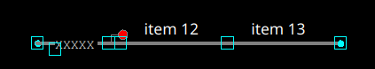
+
For `UK_3_ASPECTS_TP` signal type, for instance, the "Not train params" would be set to
+
 {'UK_CLEAR': ["12", "13"], 'UK_CAUTION': ["12"]}
+
so that it shows :
+
- "Clear" if there are no trains on item 12 and item 13,
- "Caution" if there are no trains on item 12.

+
NOTE: A variant of this construction is to have item 13 as an invisible link, giving the impression that the
signal turns to "Caution" when the train leaves the area and to "Clear" after a while.

Level crossover::
This is a construction like in the "drain" demo simulation:
+
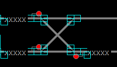
+
Set the "Conflict Item" on each item of the cross to the other one to prevent a route top-left/bottom-right to be set at the same
time as a bottom-left/top-right route although they do not share any item.

Bridge crossover::
Use invisible links to nicely represent tracks going over or under another one:
+
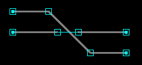
+
This will render like this:
+
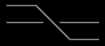

Use lines for decoration::
Sometimes, you need to add decorative graphics.
You can use line items for this purpose.
+
This is the case in the "London Liverpool Street" simulation to represent "Bishopsgate tunnel".
+
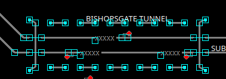
+
This will render like this:
+
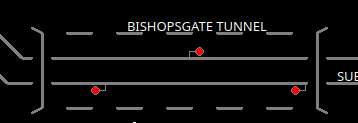

=== Define Routes

Routes are defined in the "Routes" tab.

==== Adding a route

To define a route, follow these steps:

1. Click on each point on the route to change their position and have all points correct.
2. Click on the entry signal. Its line should turn blue.
3. Click on the exit signal. The route should highlight. If it doesn't, it means that TS2 could not connect the entry
signal to the exit signal with the points in their current position.
4. Click on "Add route" to register the route.
If the route already exists, nothing happens and a message is displayed in the status bar at the bottom of the screen.

NOTE: Right click on the entry signal of a highlighted route to abort route definition.

==== Deleting a route

When you select a route in the route's table, it will be highlighted on the layout above.

Find the route you want to delete in the route's table, then click on "Delete Route".

==== CSV Export / Import

You can export all the routes as a CSV list, edit it and import it again.

WARNING: When you import a CSV file, it will delete all existing routes.
Make sure that you have all the routes in the imported file.

=== Define Train Types

Managing train types is straightforward.
Refer to <<Train Types,Train Types>> section for the explanation of each attribute.

You can export all the train types as a CSV list, edit it and import it again.

WARNING: When you import a CSV file, it will delete all existing train types.
Make sure that you have all the train types in the imported file.

=== Define Services

Defining a service is also straightforward.
A service is a train schedule, with its main attributes displayed in the top table.
Each service contains several lines referring to a station or a waypoint.
When you click on a service, you can see/edit its lines in the bottom table.

You can export all the services as a CSV list, edit it and import it again.

NOTE: The service lines are represented by the repetition of the last columns.
We strongly advise you to create a service with three lines in the editor and export it to understand the schema.

WARNING: When you import a CSV file, it will delete all existing services.
Make sure that you have all the services in the imported file.

=== Define Trains

==== Adding trains from services

The usual and quickest way to add trains is to click on "Setup trains from services".
This will create one train per service that is not following another one.

WARNING: Clicking on "Setup trains from services" will remove all existing trains.

Then you can modify each train manually.

==== Adding a new train manually

Click on "Add new" button to create a new train.
The train will appear at the bottom of the list.
You can now modify its attributes. See <<Trains,train attributes>> for more details.

TIP: You can set the position of the train head by selecting a train and click on the layout above.
A yellow arrow will show the train head position.
You can reverse it by clicking on "Reverse direction".

==== Deleting a train

Select the train you want to delete and click the "Delete" button.

== Websocket API

=== URI

The TS2 Simulation Server exposes 2 endpoints:

- Websocket endpoint at `ws://<SERVER>:22222/ws`
- HTTP Web client endpoint at `http://<SERVER>:22222`

Where `<SERRVER>` is the hostname or the IP of the server (e.g. `localhost` if you started the server on your computer).

=== Initializing a websocket connection

1. Open a connection to the websocket endpoint.
2. The first request to the server MUST be a valid login request.
Otherwise, the connection will be shut down by the server. A login request has the following format:
+
  {
    "object": "server",
    "action": "register",
    "params": {
      "type": "client",
      "token": "<TOKEN>"
    }
  }
+
Where `<TOKEN>` is the simulation's `clientToken` defined in the <<Options,options>>.
It defaults to `client-secret` if it has not been customized.
3. The server will return a <<StatusMessage,status message>> with `OK` result if the login request succeeded.


=== Requesting data from the server

==== Request format

You can retrieve data from the server at any time by sending a request message over the websocket connection.
Request messages have the following syntax:

  {
    "id": <ID>,
    "object": "<OBJECT>",
    "action": "<ACTION>",
    "params": <PARAMS>
  }

The `"id"` parameter is optional, but highly recommended in production.
When set, `<ID>` is an optional integer that will be returned by the server in the response so that the
client can match the response with the request.

The `"params"` attribute format depends on the requested actions and is optional if the action has no parameters.


The tables in the following sections shows all possible actions and their parameters that can be requested from the server.

==== Response format

All messages received from the server have the following format:

  {
    "msgType":"<MSG_TYPE>",
    "id": <ID>,
    "data": <PAYLOAD>
  }

`<MSG_TYPE>` is either:

- `response` if it is a direct response to a client request.
In this case `<ID>` is the ID sent in the request or `0` if there where none.
- `notification` if it is a message sent by the server following a fired event.
In this case, the `"id"` attribute is not sent.

`<PAYLOAD>` is the actual data of the response. Its format depends on the request

====
[[StatusMessage]]
**Status Message**

A status message is returned by the server to acknowledge a request that does not require the server to send data.
Its format is the following:

  {
    "msgType":"response",
    "id": <ID>,
    "data": {
      "status": "<STATUS>",
      "message": "<MSG>"
    }
  }

- `<STATUS>` is either `OK` or `KO`
- `<MSG>` is a human readable message explaining the situation.

====


==== `server` Object
[[ServerObject]]

[cols="1,2,2,3"]
|===
|Action|Params|Returned payload|Description

|`register`
|`{"type": "client", "token": "<TOKEN>"}`
|<<StatusMessage,Status Message>>
|Register this client in the simulation. See <<Initializing a websocket connection,websocket connection>>.

`<TOKEN>` is the simulation's `clientToken` defined in the <<Options,options>>

|`addListener`
|`{"event": "<EVENT>", "ids": [<IDS>]}`
|<<StatusMessage,Status Message>>
|Add a listener to the given event, to get notified each time this event is fired.

`<EVENT>` is the name of a simulation event.
`<IDS>` is a list of object ids that we listen (strings except trains which have integer ids).
If no ids are given, then the listener is added for all objects concerned by the event.

|`removeListener`
|`{"event": "<EVENT>"}`
|<<StatusMessage,Status Message>>
|Removes all listeners to the given event.

`<EVENT>` is the name of a simulation event.

|`renotify`
|`{}`
|<<StatusMessage,Status Message>>
|Ask the simulation to be immediately notified of the last event of each kind that we listen to.

The server will simply return an `OK` status message and the actual notifications will be pushed as normal notifications,
independently from this request.

|===

==== `simulation` Object

[cols="1,2,2,3"]
|===
|Action|Params|Returned payload|Description

|`start`
|`{}`
|<<StatusMessage,Status Message>>
|Start the simulation.

|`pause`
|`{}`
|<<StatusMessage,Status Message>>
|Pause the simulation.

|`isStarted`
|`{}`
|`true` or `false`
|Request the simulation state.

Returns `true` if the simulation is started and `false` if it is paused.

|`dump`
|`{}`
|<<Simulation model,Simulation object>>
|Request the simulation data.

Returns a complete dump of the simulation at the current state.

|===

==== `option` Object

[cols="1,2,2,3"]
|===
|Action|Params|Returned payload|Description

|`list`
|`{}`
|<<Options,Map of options>>
|Returns the current options values

|`set`
|`{"name": <OPTION_KEY>, "value": <VALUE>}`
|<<StatusMessage,Status Message>>
|Set the option given by `<OPTION_KEY>` to the given `<VALUE>`.

|===

==== `route` Object

[cols="1,2,2,3"]
|===
|Action|Params|Returned payload|Description

|`list`
|`{}`
|Map of <<Routes,route objects>> indexed by their `id`.
|Returns all the routes of the simulation.

|`show`
|`{"ids": [<IDs>]}`
|Map of <<Routes,route objects>> indexed by their `id`.
|Returns the routes of the simulation with the given string `<IDs>`.

|`activate`
|`{"id": "<ID>", "persistent": <bool>}`
|<<StatusMessage,Status Message>>
|Request activation of the route with the given `<ID>`.
If persistent is true, then the route is activated as a persistent Route (state 2).

|`deactivate`
|`{"id": "<ID>"}`
|<<StatusMessage,Status Message>>
|Request deactivation of the route with the given `<ID>`.

|===

==== `train` Object
[[TrainObject]]

[cols="1,2,2,3"]
|===
|Action|Params|Returned payload|Description

|`list`
|`{}`
|List of <<Trains,train objects>>.
|Returns all the trains of the simulation.

|`show`
|`{"ids": [<IDs>]}`
|List of <<Train,route objects>>.
|Returns the trains of the simulation with the given integer `<IDs>`.

|`reverse`
|`{"id": <ID>}`
|<<StatusMessage,Status Message>>
|Request that the train with the given integer `<ID>` reverses.
The train will reverse only if it is stopped.

|`proceed`
|`{"id": <ID>}`
|<<StatusMessage,Status Message>>
|Request that the train with the given integer `<ID>` proceeds with caution.
If the train is stopped in front of a red signal, this instructs it to pass the signal.

|`setService`
|`{"id": <ID>, "service": "<SERVICE_CODE>"}`
|<<StatusMessage,Status Message>>
|Assign the service with the given `<SERVICE_CODE>` to the train with the given integer `<ID>`.

|`resetService`
|`{"id": <ID>}`
|<<StatusMessage,Status Message>>
|Restart the current service on the train with the given integer `<ID>`.
The train will now expect to stop at the station of the first line of the service.

|===

==== `trackItem` Object

[cols="1,2,2,3"]
|===
|Action|Params|Returned payload|Description

|`list`
|`{}`
|Map of <<Track Items,track items objects>> indexed by their `id`.
|Returns all the items of the simulation.

|`show`
|`{"ids": [<IDs>]}`
|Map of <<Track Items,track items objects>> indexed by their `id`.
|Returns the items of the simulation with the given string `<IDs>`.

|===

==== `place` Object

[cols="1,2,2,3"]
|===
|Action|Params|Returned payload|Description

|`list`
|`{}`
|Map of <<Track Items,place objects>> indexed by their `placeCode`.
|Returns all the places of the simulation.

|`show`
|`{"ids": [<PLACE_CODES>]}`
|Map of <<Track Items,place objects>> indexed by their `placeCode`.
|Returns the place of the simulation with the given string `<PLACE_CODES>`.

|===

==== `trainType` Object

[cols="1,2,2,3"]
|===
|Action|Params|Returned payload|Description

|`list`
|`{}`
|Map of <<Train Types,train type objects>> indexed by their `id`.
|Returns all the items of the simulation.

|`show`
|`{"ids": [<IDs>]}`
|Map of <<Train Types,train type objects>> indexed by their `id`.
|Returns the train types of the simulation with the given string `<IDs>`.

|===

==== `service` Object

[cols="1,2,2,3"]
|===
|Action|Params|Returned payload|Description

|`list`
|`{}`
|Map of <<Services,service objects>> indexed by their `id`.
|Returns all the services of the simulation.

|`show`
|`{"ids": [<IDs>]}`
|Map of <<Services,service objects>> indexed by their `id`.
|Returns the services of the simulation with the given string `<IDs>`.

|===

=== Server Event Notifications

Clients can add a listener to a simulation event to be notified when this event is fired.

See <<ServerObject,server Object>> for adding a listener.

When an event is fired, the client receives a notification with the following format:

  {
    "msgType": "notification",
    "data":{
      "name": "<EVENT>",
      "object": <PAYLOAD>
    }
  }

- `<EVENT>` is the name of the event fired.
- `<PAYLOAD>` depends on the event and is usually the modified object with its new attributes.

The table below lists all available events with the payload it sends with its notification.

[cols="1,2,4"]
|===
|Event|Returned Payload|Description

|`Clock`
|Current Time string
|Fired each time the clock changes, i.e. every 500ms.

|`StateChanged`
|`{"value": true\|false}`
|Fired when the simulation is started or paused.

The returned value is `true` if the simulation is now running and `false` if it is now paused.

|`OptionsChanged`
|<<Options,Options map>>
|Fired when an option is changed (except `currentTime`).
The whole options map is sent with the notification.

|`RouteActivated`
|<<Routes,Route object>>
|Fired when a route is activated.

Returns the activated route.

|`RouteDeactivated`
|<<Routes,Route object>>
|Fired when a route is deactivated.

Returns the deactivated route.

|`TrainStoppedAtStation`
|<<Trains,Train object>>
|Fired when a train stops at a scheduled station.

Returns the train that stopped.

|`TrainDepartedFromStation`
|<<Trains,Train object>>
|Fired when a train departs from a scheduled station.

Returns the train that departed.

|`TrainChanged`
|<<Trains,Train object>>
|Fired when a train sees one of its attribute changed.
If the train is running, the event will be fired every 500ms as its position would have changed.

Returns the modified train.

|`SignalaspectChanged`
|<<Signal Items,Signal Object>>
|Fired when the aspect of a signal changes.

Returns the signal which changed its aspect.

|`TrackItemChanged`
|<<Track Items,Track Item Object>>
|Fired when a track item sees one of its attribute changed.
This can be for any reasons, such as a route set, a train entering the item, an internal state changed, etc.

Returns the modified item.

|`MessageReceived`
|<<Messages,Message Object>>
|Fired when a message is added on the message logger.

Returns the new message.

|===

== Developing a Client

This section presents the way the standard python client is developed as guidelines for other client developers.

NOTE: In this section, calls to the websocket API are represented in the `object.action(params)` form, such as
`train.proceed(id=10)`

=== Getting the simulation dump

When a clients connects to a simulation server, the first action after registering is getting a simulation dump to be
able to render the layout, schedules and train tables.

This is done by calling `simulation.dump()`.
Collect all the needed information from the dump and build up your UI with it.

A typical UI would include the following:

- A layout
- A train table, with train details when a train is clicked
- A service table, with service details and service lines when a service is clicked
- A message logger

=== Register listeners

Register your client to the following listeners (for all ids) and connect them to your client's internal actions as follow:

[cols="1,4"]
|===
|Event |Client Internal Action

|`trackItemChanged`
|Redraw the given item.

|`clock`
|Change the clock display with the new time

|`routeActivated`
|In standard client, we use this only to check if the route is persistent or not, to display it on the layout.

|`trainChanged`
|Refresh train data in the train's table. Refresh of the layout is done by `trackItemChanged` event.

|`messageReceived`
|Notify the user of the new message, typically by adding it to the logger.

|`optionsChanged`
|Update display of options values when applicable (title, score, etc.).

|`stateChanged`
|Update the UI to show running or paused simulation.

|===

This way, after initial setup the UI updates will be done by notifications only.

=== Get renotified to sync the UI

As simulation time passed between the first call to dump, the UI rendering and the connection of the listeners, the UI
is certainly out of sync with the simulation server by now.

To solve this issue, you can call `server.renotify()` to get a new notification of the last event of every type for
every item that you are listening to. Thanks to the connection of the events with the internal actions,
this should bring the UI fully synced again.

=== Drawing trains and activated routes

The track item information, whether received from `simulation.dump()`, `trackItem.list()`, `trackItem.show(...)` or
sent through a `trackItemChanged` notification includes:

- Trains that are currently present on the item (See <<TrainEndsMaps,"trainEndsFW" and "trainEndsBK" maps>>).
- If there is a route set on the item and which one
(See `activeRoute` in <<Track Items>> and `nextActiveRoute` and `previousActiveRoute` on <<Signal Items>>.

You should primarily use this information to display trains and routes on the scenery and not try to recompute the data
from trains or route information.

=== Interact with the simulation

There are only a few ways to interact with the simulation:

==== Change options

Options can be changed at runtime with `option.set(...)`.

You should not assume the option has been changed just because you received an OK response,
since another client might have changed it at the same time.
Instead add a listener to `optionsChanged` and wait for the notification.

==== Start/Pause the simulation

Start/Pause the simulation with `simulation.start()` and `simulation.pause()`.

You should not assume that the simulation is started or paused just because you received an OK response,
as the simulation status may have been changed by another client.
Instead add a listener to `stateChanged` and wait for the notification.

==== Set or unset a route

Route can be set with `route.activate(...)` and unset with `route.deactivate()`.

These actions take a route ID as parameter:
it the responsibility of the client to provide the correct route ID from the user interaction on the UI.
For example, in the standard client, a route is set by clicking on the entry signal, then on the exit signal.
The standard client converts these clicks to a route ID which it sends to the server.
The route ID is computed using the information returned by the `simulation.dump()` call.

You should not assume that the route is set or unset just because you received an OK response,
as the route may have been set/unset by another client.
Instead add a listener to `routeActivated` and/or `routeDeactivated` and wait for the notification.

==== Give instructions to the train driver

The following instructions can be sent to the train driver:

- `train.reverse(...)`
- `train.proceed(...)`
- `train.setService(...)`
- `train.resetService(...)`

See <<TrainObject,train object>> for the meaning of each instruction.

You should not assume that the instruction has been applied since another client may have sent a different instruction
in the meantime. Instead add a listener to `trainChanged` and wait for the notification.
