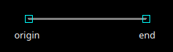
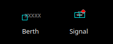
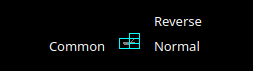

= TS2 Technical Manual
Author Nicolas Piganeau
:prewrap!:
:toc:
:sectnums:

== Introduction

This document describes the internals of TS2.
It is aimed both at simulation writers and developers who want to interact with the simulation through its API.

== Architecture

TS2 is composed of 3 main components:

- The simulation server
- Clients
- The editor

=== The simulation server

This is the central piece of the software. It is shipped with the TS2 release.

It can be run:

- Locally for a standalone game
- Remotely on another PC or even on a cloud server for multi-player gaming

The TS2 sim server tasks are

- To centralize the game data, that is:
    * Scenery layout (The track items, and how they are connected to each other, their states, etc.)
    * Possible and set routes
    * Services and Trains

- To enforce interlocking on :
    * Route setting/unsetting
    * Change of points position
    * Update of signals aspects

- To compute train behaviour, speed and position

- Make the clock tick

The TS2 sim server communicates with clients through websocket.

.TS2 overall architecture
[plantuml, architecture_bdd, png]
....
usecase Client as "Client
(User Interface)"
:User: ..> (Client)
(Client) --> (Simulation Server) : Websocket \ncommunication
(Simulation Server) ---> (Client)
rectangle "Simulation file" as file
(Simulation Server) --> file : loads
:Sim Writer: ..> (Editor)
(Editor) --> file : creates
....

=== Clients

Clients are software that interact with the simulation server, typically to provide a user interface.

Many clients can be connected at the same time to the same simulation server.

The TS2 release ships two clients:

- The standard Python client, which is the main "all-in-one" client that is also able to spawn simulation servers and give access to the editor.
- A minimalist web client which is included with the simulation server and mainly used for API testing.

=== The Editor

The editor is part of the standard Python client and is used to create or modify simulations with a graphical user interface.

== Simulation model

A simulation in TS2 is modelled by the following objects:

- Options
- Track items
- Routes
- Train Types
- Services
- Trains

=== Options

This is a list of options for the simulation.
They must be set at simulation writing time, but can be modified during the simulation.

The default values in the table below are set by the editor.
The simulation server itself has no default and expect all options to be set.

[cols="2,>3,8"]
|===
| Key ^| Default Value | Description

|title
|
|Title of the simulation

|description
|
|Detailed description of the simulation targeted at the user.

|clientToken
|client-secret
|Client token to connect to the simulation.
Unless you want to run a public instance of TS2 you can leave it to the default value.

|version
|0.7
|Defines the version of the file format. Do not change this value.

|timeFactor
|5
|The number of seconds elapsed in the simulation for each real seconds.
This value can be set between 1 and 10.

|currentTime
|06:00:00
|Current time inside the simulation.
When writing a simulation this will be the time when the simulation starts.
During the simulation run, this value is updated every 500ms.

|warningSpeed
|8.33
|Speed (in metres per second) a train driver will observe when given a "Proceed with caution" manual order from the dispatcher.
Default value is 30 km/h.

|currentScore
|0
|This value is the current penalty score of the simulation.
Obviously, it should be set to 0 when writing a simulation.

|defaultMaxSpeed
|44.44
|This speed (in metres per second) will be used by the simulation whenever a track item has a maximum speed of 0.
Default value is 160 km/h.

|defaultMinimumStopTime
|[(45, 75, 70), (75, 90, 30)]
|The time in seconds a train will normally stop at a station.
It can be a single value in seconds, or a <<DelayGenerators,delay generator>>.

|defaultDelayAtEntry
|[(-60, 0, 50), (0, 60, 50)]
|The delay in seconds a train will have by default when entering the area.
It can be a single value in seconds, or a <<DelayGenerators,delay generator>>.
If the value is negative, the train will be early.

This value can be overridden train by train.

|trackCircuitBased
|false
|This value defines the way the trains will be represented on the layout.
If it is true, each track item will be considered as a track circuit and will be either marked free or occupied.
If it is false, the occupied area will show the real position of the train.

This option should be set to true if you care about realism.

|defaultSignalVisibility
|100
|Distance in metres at which a driver can see a signal and will start taking it into account.

|wrongPlatformPenalty
|5
|Penalty points that will be added to the score each time a train stops at a wrong platform.

|wrongDestinationPenalty
|100
|Penalty points that will be added to the score each time a train is not routed out of the area at the correct exit point.

|latePenalty
|1
|Penalty points that will be added to the score per minute lost in the area.
Delay at entry is subtracted from the actual delay to define it.

|===


====
[[DelayGenerators]]
.**Delay generators**

Delay generators are expressions that will yield a random value according to a specified distribution.

They are composed of a list of triplets such as:
```python
[(45, 75, 70), (75, 90, 30)]
```
For each triplet, the values are in order:

- Minimum value
- Maximum value
- Percentage of occurrence

In the example above, the expression means:

- 70% of the time the value will be between 45 and 75
- 30% of the time the value will be between 75 and 90

Inside each triplet, the value is yielded with a uniform distribution.

====

=== Track Items

The layout of the tracks in the area is defined by 8 track item types:

- Line
- Signal
- Points
- Platform
- Place
- End
- InvisibleLink
- Text

Each type has "definition attributes" which can be set with the editor and "technical attributes" which are returned by the simulator through the API.

==== Common Attributes

All items share the following attributes.

===== Definition Attributes

[cols="2,3,8"]
|===
|Technical Name |Attribute Name in Editor |Description

|id
|ID
|Unique ID of the item. The editor sets it automatically and it cannot be modified by the user.


|\\__type__
|Type
|Type of the item. The type of an item cannot be changed.

|name
|Name (or Text)
|Name of the item as known in the real world (e.g. signal number).

|x
|Position (or Point1)
|Position of the item on the x-axis.

|y
|Position (or Point1)
a|Position of the item on the y-axis.

WARNING: y-axis increases from top to bottom.

|maxSpeed
|Maximum speed (m/s)
|Maximum speed allowed on this item in metres per second.

|realLength
|Real Length (m)
|Length of this item in real life (in metres).

|conflictTiId
|Conflict item ID
|Set to the ID of another item to prevent route setting on both items at the same time.
This feature is typically used to interlock track crossovers without points.

|===

===== Technical Attributes

[cols="2,8"]
|===
|Technical Name  |Description

|previousTiId
|ID of the track item connected to this item at its "origin" (see each item description).

This is computed automatically by the editor.

|nextTiId
|ID of the track item connected to this item at its "end" (see each item description)

This is computed automatically by the editor.

|activeRoute
|If a route is set on this item, this value is the ID of that route, otherwise it is null.

|activeRoutePreviousItem
|If a route is set on this item, this value is the ID of the item before this one in the direction of the route, otherwise it is null.

|trainEndsFW
a|Map of train extremities that are on the "end" side of this item (see each item description).

For example, `{"2": 79}` means that train with ID "2" has one of its extremity (head or tail) at 79 metres from this items "origin".

|trainEndsBK
a|Map of train extremities that are on the "origin" side of this item (see each item description).

For example, `{"2": 3}` means that train with ID "2" has one of its extremity (head or tail) at 3 metres from this items "origin".

|===


==== Line Items

A line item connects two points on the scenery.
One is defined as the "origin" and the other one as the "end" (arbitrarily).



Common attributes `x` and `y` define the position of the "origin", known as "Point 1" in the editor.

[cols="2,3,8"]
|===
|Technical Name |Attribute Name in Editor |Description

|xf
|Point 2
|Position of "end" on the x-axis.

|yf
|Point 2
a|Position of "end" on the y-axis.

WARNING: y-axis increases from top to bottom.

|placeCode
|Place code
|Code of the place item this line item belongs to.
The place being a station or a waypoint.

|trackCode
|Track code
|The code of this track as known in the place defined by `placeCode`.
Typically a line or platform number.

|===

==== Signal Items

Signal items are composed of two elements, the signal itself and the "berth" that will hold train descriptors on the layout.



===== Standard Attributes

Common attributes `x` and `y` define the position of entry in the signal which is the left point of the signal itself.
Note that when the signal is reversed, then it is the point of the signal on the right.

[cols="2,3,8"]
|===
|Technical Name |Attribute Name in Editor |Description

|signalType
|Signal Type
|The code of the type of signal as defined in the signal library (e.g. `UK_3_ASPECTS`)

|reversed
|Reverse
|If true, then the signal is for train coming from the right of the layout.

|xn
|Berth Origin
|Position of the berth on the x-axis.
The position is the bottom left corner of the berth.

|yn
|Berth Origin
a|Position of the berth on the y-axis.
The position is the bottom left corner of the berth.

WARNING: y-axis increases from top to bottom.

|===

===== Custom properties

Custom properties are defined by the available signal conditions.
Each property takes as value a map with signal aspect codes as keys and a list of related object IDs as values, such as:
```
{"UK_CLEAR": ["2", "34", "48"], "UK_CAUTION": ["2", "34"]}
```

Properties taken into account depend on the signal type.
The editor automatically prefills the properties depending on the signal type.
The table below lists the properties that are defined by conditions in the current version.

NOTE: See also <<Signal Aspect Resolution>>

[cols="2,2,2,5"]
|===
|Condition |Property Name in Editor |Related Objects |Description

|TRAIN_NOT_PRESENT_ON_ITEMS
|No Trains params
|Track Items
|List of items IDs on which there must not be a train for the aspect to show.
If there is a train on a single item of the list, the aspect does not show.

|TRAIN_PRESENT_ON_ITEMS
|Train Present Params
|Track Items
|List of items IDs on which there must be a train for the aspect to show.
If there a train is missing on a single item of the list, the aspect does not show.

|ROUTES_SET
|Route set params
|Routes
|List of route IDs which can be activated for the aspect to show.
The aspect shows as soon as at least one of the specified route is active.

|===

==== Points Items

Points items are track switches.
They have three extremity: the common, normal and reverse ends as shown below.



===== Definition Attributes

Common attributes `x` and `y` define the position of the center of points item.
Each extremity is at -5 or +5 along x and y axis.

[cols="2,3,8"]
|===
|Technical Name |Attribute Name in Editor |Description

|xf
|Common End
|Position of the common extremity along the x-axis.
Must be equal to -5, 0 or +5.

|yf
|Common End
a|Position of the common extremity along the y-axis.
Must be equal to -5, 0 or +5.

WARNING: y-axis increases from top to bottom.

|xn
|Normal End
|Position of the normal extremity along the x-axis.
Must be equal to -5, 0 or +5.

|yn
|Common End
a|Position of the normal extremity along the y-axis.
Must be equal to -5, 0 or +5.

WARNING: y-axis increases from top to bottom.

|xr
|Reverse End
|Position of the reverse extremity along the x-axis.
Must be equal to -5, 0 or +5.

|yr
|Reverse End
a|Position of the reverse extremity along the y-axis.
Must be equal to -5, 0 or +5.

WARNING: y-axis increases from top to bottom.

|===

[NOTE]
====
In the editor, these attributes are defined by setting the cardinal point of the extremity such as:

- N => (0, -5)
- SW => (-5, +5)
====

===== Technical Attributes

[cols="2,8"]
|===
|Technical Name  |Description

|reverseTiId
|ID of the track item connected to this item at its "reverse" end.

This is computed automatically by the editor.

|reverse
|true if the points are set to the reverse end, and false if they are set to the normal end.

|===

==== Platform Items

Platform items are mostly decorative.
They can be linked to a place and a track code.

image::platformitem.png[align=center]

Common attributes `x` and `y` define the position of "Point 1".

[cols="2,3,8"]
|===
|Technical Name |Attribute Name in Editor |Description

|xf
|Point 2
|Position of Point 2 along the x-axis.

|yf
|Common End
a|Position of Point 1 along the y-axis.

WARNING: y-axis increases from top to bottom.

|placeCode
|Place code
|Code of the place item this platform item belongs to.
The place being a station or a waypoint.

|trackCode
|Track code
|The code of this platform as known in the place defined by `placeCode`.
Typically a platform number.

|===

==== End Items

End items are technical items used to connect free extremities of the simulation.


All extremities, including those after a buffer **MUST** be filled with an end item, so that all items are linked to other items.

==== Place Items


== Signal Aspect Resolution
